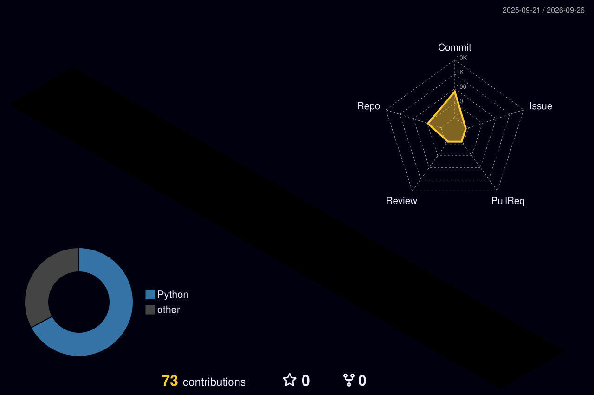

<div align="center">

<!-- ═══════════════════════════════════════════════════════════════ -->
<!--                     HERO BANNER                               -->
<!-- ═══════════════════════════════════════════════════════════════ -->

[](https://git.io/typing-svg)


[](https://git.io/typing-svg)

<br/>

[](https://v0-portfolio-saravanan-b.vercel.app/)
[](https://www.linkedin.com/in/saravanan-b-aiml09/)
[](mailto:Mrsaravananb@gmail.com)
[](https://drive.google.com/file/d/1EB7khYWSGGL9kBg6AxHeCYa3pab6UXHd/view?usp=sharing)

<br/>


<br/>


</div>

---

<!-- ═══════════════════════════════════════════════════════════════ -->
<!--                      ABOUT ME                                  -->
<!-- ═══════════════════════════════════════════════════════════════ -->

##  About Me


```python
class SaravananB:
    """AI Engineer building production-grade intelligent systems."""

    def __init__(self):
        self.name         = "Saravanan B"
        self.role         = "AI/ML Engineer & Data Scientist"
        self.education    = "M.Sc Data Science @ SRM Institute (2026)"
        self.location     = "Chennai, India 🇮🇳"
        self.open_to      = ["Full-Time Roles", "Research Collab", "Open Source"]

    @property
    def expertise(self):
        return {
            "llm_systems"    : ["RAG Pipelines", "vLLM", "Agentic AI", "LangChain"],
            "computer_vision": ["YOLOv8", "EfficientNet", "Medical Imaging", "OCR"],
            "nlp"            : ["BERT", "Tamil-BERT", "Transformers", "mBERT"],
            "deployment"     : ["FastAPI", "Docker", "Streamlit", "React"],
        }

    @property
    def currently(self):
        return {
            "building" : "Multi-Agent LLM Applications",
            "learning" : "MLOps, LangGraph, Advanced RAG",
            "exploring": "Open Source AI Contributions",
            "goal"     : "AI Engineer @ a top AI-first company",
        }

    def __repr__(self):
        return "Turning ideas into intelligent systems, one model at a time 🚀"
```

<br clear="right"/>

---

<!-- ═══════════════════════════════════════════════════════════════ -->
<!--                     EXPERIENCE TIMELINE                        -->
<!-- ═══════════════════════════════════════════════════════════════ -->

##  Professional Experience

<div align="center">

| 🗓️ Period | 💼 Role | 🏢 Organization | 🏷️ Type |
|:---:|:---:|:---:|:---:|
| **Dec 2025 – Apr 2026** | 🤖 AI Developer Intern | Zubera Digital Technologies | On-site · Production |
| **Jan – Mar 2025** | ☁️ AI-ML Engineer | AWS Academy | Virtual · Certified |
| **Jul – Sep 2024** | 🌐 AI-ML Engineer | Google for Developers (AICTE) | Virtual · Grade E (Excellent) |
| **Nov 2023 – Feb 2024** | 📊 Data Scientist Intern | Innodatatics | On-site |

</div>

> 💡 **At Zubera**: Built and deployed a **production-grade AI Financial Advisory Bot** (Zubera Bot) using vLLM + Llama 3.1 8B — eliminating paid API costs while serving real users. Also shipped **Zapdoc**, an AI invoice extraction SaaS with Stripe payments integrated.

---

<!-- ═══════════════════════════════════════════════════════════════ -->
<!--                     TECH STACK                                 -->
<!-- ═══════════════════════════════════════════════════════════════ -->

##  Tech Stack

<div align="center">

### 🐍 Languages & Core


### 🤖 Generative AI & LLMs


### 🧠 RAG & Vector Stores


### 🔬 Deep Learning & Computer Vision


### 📊 Data Science & NLP


### ⚙️ Backend, Deployment & Tools


### 🗄️ Databases & Cloud


</div>

---

<!-- ═══════════════════════════════════════════════════════════════ -->
<!--                   FEATURED PROJECTS                            -->
<!-- ═══════════════════════════════════════════════════════════════ -->

<div align="center">

</div>

##  Featured Projects

<!-- PROJECT 1 -->
<details open>
<summary><b>🤖 Zubera Bot — AI Financial Advisory Assistant</b> &nbsp; &nbsp;</summary>

<br/>

> **Real-time financial intelligence — stock analysis, MF recommendations & WhatsApp expense tracking — powered by local LLMs with zero API cost**

| Attribute | Detail |
|:---|:---|
| **Architecture** | Agentic LLM + RAG + Tool-Calling |
| **LLM** | vLLM serving Llama 3.1 8B (local inference) |
| **Vector Store** | ChromaDB + FAISS |
| **API Layer** | FastAPI + PostgreSQL |
| **Key Win** | 🏆 Eliminated paid API costs entirely via local inference |

**Tech:** `Python` `FastAPI` `LangChain` `vLLM` `Llama 3.1 8B` `ChromaDB` `LiteLLM` `Docker` `PostgreSQL`

[](https://github.com/Saravananb91/zuberabot)

</details>

---

<!-- PROJECT 2 -->
<details open>
<summary><b>📄 Zapdoc — AI Invoice Extraction SaaS Platform</b> &nbsp; &nbsp;</summary>

<br/>

> **End-to-end SaaS for automated invoice digitization — from PDF/image to structured JSON/CSV/Excel with Stripe payments**

| Attribute | Detail |
|:---|:---|
| **OCR Engine** | Google Gemini 2.5 Flash |
| **Backend** | FastAPI + async processing |
| **Frontend** | React 18 |
| **Monetization** | Stripe Payments + Credit System |
| **Output Formats** | JSON / CSV / Excel / ZIP |

**Tech:** `Python` `FastAPI` `React 18` `Google Gemini 2.5` `PostgreSQL` `Stripe API` `Docker`

[](https://github.com/Saravananb91/Zapdoc)

</details>

---

<!-- PROJECT 3 -->
<details open>
<summary><b>🩸 AI Microscopic Blood & Disease Analyzer</b> &nbsp; &nbsp;</summary>

<br/>

> **GPU-accelerated medical imaging model detecting Malaria, Leukemia & Sickle Cell Anemia with AI-generated diagnostic reports**

| Attribute | Detail |
|:---|:---|
| **Detection** | YOLOv8 for blood cell localization |
| **Classification** | EfficientNetB3 for disease prediction |
| **Diseases Detected** | Malaria, Leukemia, Sickle Cell Anemia |
| **Report Generation** | LangChain + OpenAI GPT → JSON diagnostic reports |
| **UI** | Streamlit real-time dashboard |

**Tech:** `YOLOv8` `TensorFlow` `EfficientNetB3` `LangChain` `OpenAI` `OpenCV` `Streamlit`

[](https://github.com/Saravananb91/blood-disease-analysis-)

</details>

---

<!-- PROJECT 4 -->
<details>
<summary><b>🗣️ Hybrid QA System for Tamil NLP</b> &nbsp; &nbsp;</summary>

<br/>

> **Research-grade hybrid BERT + LSTM architecture for low-resource Tamil language question answering — under review for academic publication**

| Attribute | Detail |
|:---|:---|
| **Architecture** | BERT + LSTM Hybrid |
| **Models** | mBERT, Tamil-BERT, custom tokenization |
| **Metric** | 85% BLEU on validation set |
| **Domain** | Low-resource NLP, South Asian Languages |
| **Status** | 📝 Under peer-review for publication |

**Tech:** `BERT` `mBERT` `Tamil-BERT` `LSTM` `HuggingFace` `PyTorch`

[](https://github.com/Saravananb91/tamil-qa)

</details>

---

<!-- PROJECT 5 -->
<details>
<summary><b>📰 News Article Classification NLP Pipeline</b> &nbsp; &nbsp;</summary>

<br/>

> **Multi-model NLP pipeline: BERT classification + Pegasus summarization + T5 headline generation with live Streamlit demo**

**Tech:** `BERT` `Pegasus` `T5` `Streamlit` `HuggingFace`

[](https://github.com/Saravananb91/news-article-classification-)
[](https://news-classifier-demo.streamlit.app)

</details>

---

<!-- PROJECT 6 -->
<details>
<summary><b>🚗 Road Pothole Detection — CNN + RNN</b> &nbsp;</summary>

<br/>

> **Real-time camera-based pothole detection system with reinforcement learning reward system for autonomous vehicle navigation**

**Tech:** `CNN` `RNN` `OpenCV` `Reinforcement Learning` `Python`

[](https://github.com/Saravananb91/road-pothole-)

</details>

---

<!-- ═══════════════════════════════════════════════════════════════ -->
<!--                  AI / ML ROADMAP                               -->
<!-- ═══════════════════════════════════════════════════════════════ -->

##  AI & Data Science Roadmap

<div align="center">

| Domain | Topics | Status |
|:---|:---|:---:|
| 🤖 **Machine Learning** | Regression, Classification, Clustering, Ensemble Methods |  |
| 🧠 **Deep Learning** | CNNs, RNNs, LSTMs, Attention, Transformers |  |
| 🔬 **Computer Vision** | YOLOv8, EfficientNet, OCR, Medical Imaging |  |
| 💬 **NLP & LLMs** | BERT, GPT, Tamil-BERT, Summarization, QA |  |
| 🔗 **RAG Systems** | ChromaDB, FAISS, Chunking, Hybrid Search |  |
| 🕸️ **Agentic AI** | LangGraph, Tool-Calling, Memory, Planning |  |
| 👥 **Multi-Agent Systems** | Agent Orchestration, Role Assignment, Reflection |  |
| ☁️ **MLOps** | Docker, CI/CD, Model Serving, vLLM |  |
| 🏗️ **Data Engineering** | Selenium, Scrapy, ETL, Dashboarding |  |
| 🔄 **LLM Fine-Tuning** | LoRA, QLoRA, PEFT, RLHF |  |

</div>

---

<!-- ═══════════════════════════════════════════════════════════════ -->
<!--                  CURRENT FOCUS                                  -->
<!-- ═══════════════════════════════════════════════════════════════ -->

##  Current Focus

<div align="center">

```
╔══════════════════════════════════════════════════════════════╗
║                    🎯 WHAT I'M BUILDING IN 2026              ║
╠══════════════════════════════════════════════════════════════╣
║  🧩  Multi-Agent LLM Systems with LangGraph                  ║
║  🔍  Advanced RAG: Hybrid Search + Re-ranking                ║
║  🤗  Open Source AI Library Contributions                    ║
║  📄  Tamil NLP Research → Publication Pipeline               ║
║  🎓  M.Sc Data Science Thesis (AI/ML Focus)                  ║
║  ☁️  MLOps & Production Model Deployment                     ║
╚══════════════════════════════════════════════════════════════╝
```

</div>

---

<!-- ═══════════════════════════════════════════════════════════════ -->
<!--                   GITHUB ANALYTICS                             -->
<!-- ═══════════════════════════════════════════════════════════════ -->

##  GitHub Analytics

<div align="center">


<br/>


<br/>

[](https://github.com/Saravananb91)

<br/>

[](https://github.com/Saravananb91)

<br/>

<!-- 🧊 3D isometric contribution graph — auto-updates daily via GitHub Action (see /.github/workflows/profile-3d.yml) -->


<br/><br/>

<!-- 🐍 Snake eating your contribution graph — auto-updates daily via GitHub Action (see /.github/workflows/snake.yml) -->


</div>

---

<!-- ═══════════════════════════════════════════════════════════════ -->
<!--                   CERTIFICATIONS                               -->
<!-- ═══════════════════════════════════════════════════════════════ -->

##  Certifications & Recognition

<div align="center">

| 🏆 Certification | 🏛️ Issuer | 📅 Year | 🎖️ Grade |
|:---|:---|:---:|:---:|
| AWS Academy Graduate — Generative AI Foundations | Amazon Web Services | 2025 | ✅ Certified |
| AI-ML Virtual Internship | AWS Academy | 2025 | **A** |
| AI-ML Virtual Internship | Google for Developers (AICTE) | 2024 | **E (Excellent)** |
| Data Science Specialization | State University of New York (Coursera) | 2023 | ✅ Certified |
| International Conference Presenter — CIMA-2025 | Computational Intelligence & Mathematical Applications | 2025 | 📜 Speaker |

</div>

---

<!-- ═══════════════════════════════════════════════════════════════ -->
<!--                   CONNECT WITH ME                              -->
<!-- ═══════════════════════════════════════════════════════════════ -->

##  Let's Connect & Build Something Intelligent

<div align="center">

[](https://v0-portfolio-saravanan-b.vercel.app/)

[](https://www.linkedin.com/in/saravanan-b-aiml09/)
[](mailto:Mrsaravananb@gmail.com)
[](https://github.com/Saravananb91)

<br/>

> 💬 *Open to full-time AI/ML roles, research collaborations, and open-source contributions.*
> 📍 Based in Chennai, India — available for remote & hybrid opportunities worldwide.

</div>

---

<!-- ═══════════════════════════════════════════════════════════════ -->
<!--                      FUN SECTION                               -->
<!-- ═══════════════════════════════════════════════════════════════ -->

##  A Bit More About Me

<div align="center">

### 🖥️ Click around — this terminal actually responds

<table>
<tr><td>

```
guest@saravanan-b:~$ ls -la
```
<details>
<summary>▸ run <code>whoami</code></summary>
<br>

```
> whoami
Saravanan B
AI/ML Engineer | Data Scientist | Chennai, IN
Status: Open to full-time roles 🟢
```
</details>

<details>
<summary>▸ run <code>cat currently_building.log</code></summary>
<br>

```
> cat currently_building.log
[2026-09] Multi-agent LLM systems on LangGraph
[2026-08] Advanced RAG — hybrid search + re-ranking
[2026-07] Tamil NLP QA system → peer review
[ONGOING] MLOps / vLLM production deployment
```
</details>

<details>
<summary>▸ run <code>./deploy.sh --random-project</code></summary>
<br>

```
> ./deploy.sh --random-project
Spinning up... 🎲

  ┌──────────────────────────────────────────┐
  │  🩸 Blood Disease Analyzer                │
  │  YOLOv8 + EfficientNetB3 · 90% accuracy   │
  │  → github.com/Saravananb91/blood-disease-analysis-
  └──────────────────────────────────────────┘

Run it again for another pick — repos in rotation:
zuberabot · Zapdoc · tamil-qa · news-article-classification-
```
</details>

<details>
<summary>▸ run <code>sudo hire --me</code></summary>
<br>

```
> sudo hire --me
[sudo] password for recruiter: ********
Access granted ✅
Redirecting to → linkedin.com/in/saravanan-b-aiml09
```
</details>

</td></tr>
</table>

</div>

<br/>


<div align="center">

[](https://github.com/piyushsuthar/github-readme-quotes)

</div>

<div align="center">

```
🩸 Built an AI that detects blood diseases   →  YOLOv8 + EfficientNetB3
💬 Built a QA system for a 2000-year-old language  →  Tamil NLP Research
🤖 Deployed an LLM locally to save API costs  →  vLLM + Llama 3.1 8B
📄 Automated invoice processing end-to-end  →  Zapdoc SaaS
```

</div>

---

<!-- ═══════════════════════════════════════════════════════════════ -->
<!--                        FOOTER                                   -->
<!-- ═══════════════════════════════════════════════════════════════ -->

<div align="center">


</div>

<!--
████████████████████████████████████████████████████████
█                                                      █
█   Thanks for visiting! If my work interests you,    █
█   let's connect and build something amazing!        █
█                                                      █
████████████████████████████████████████████████████████
-->
